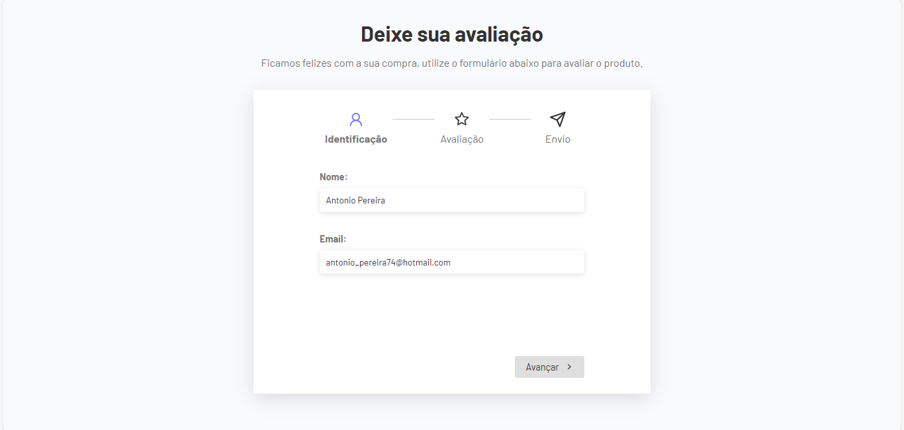
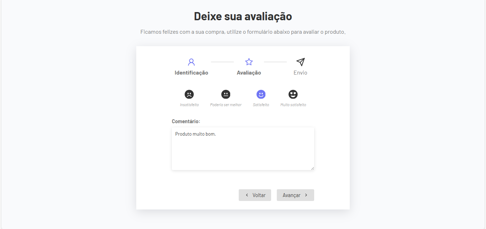
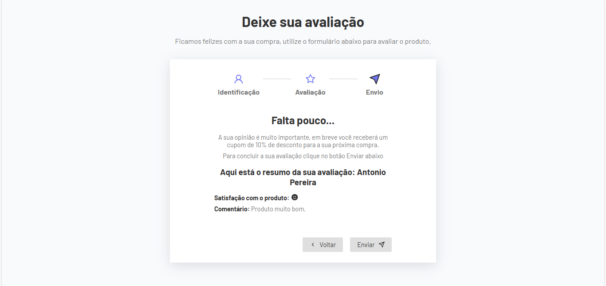

# Projeto: Formulário Multistep com React

O projeto do formulário de avaliação tem como principal recurso ser um formulário multistep, ou seja de múltiplas etapas, onde pode-se avançar e voltar as etapas com a permanência dos dados.
No projeto foi utilizado React Js com conceitos de hook e custom hook.

### Etapa - 1
Na etapa de identificação, temos que preencher os campos de nome e email do usuário.
No clique do botão 'Avançar' existe validações de HTML com o atributo 'required' que exige que o usuário preencha corretamente os campos antes de avançar.  

### Etapa - 2
Na etapa de avaliação, se o usuário clicar no botão 'Voltar' os dados preenchidos anteriormente ainda continuam registrados nos campos de identificação.
Essa etapa também existe validações de HTML que força o usuário a preencher o campo de comentário e deixar seu review de satisfação.  

### Etapa - 3
Na etapa 3 é exibido o botão de 'Enviar' e uma tela de resumo da avaliação feita na etapa anterior pelo usuário.  

### TECNOLOGIAS:
- HTML 
- CSS 
- REACT-JS 
- GIT/GITHUB

